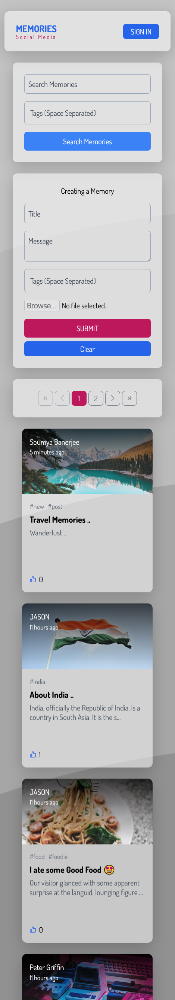

# Memories Social Media - A Full Stack Web Application

## URL - https://memoriesocialmedia.netlify.app/

### Screenshot

|         Mobile View          |         Desktop View          |
| :--------------------------: | :---------------------------: |
|  |  |

### Built with

### Tutorial Link

[Javascript Mastery](https://youtu.be/VsUzmlZfYNg)
